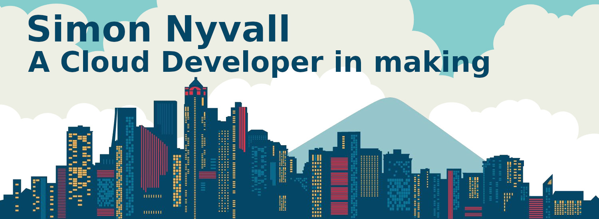

# Hi There, I am Simon Nyvall

I am a Developer, first year Cloud Developer undergraduate. Not working at the moment, instead I focus on my studies and develop hobby projects on my spare time. My study goal is to land a job as a Devop here in Gothenberg.

Aside coding on my github projects, I play the guitar, listen to music of all genres and play video games (Dota 2).

-  🔭  I'm currently studying for cloud developer at ITHS
-  🌱  I'm currently working in C++ / C# / Powershell
-  😘  2022 Goals: Contribute to open source projects

### Technolegy Stack:

<!--START_SECTION:activity-->

<!--END_SECTION:activity-->
